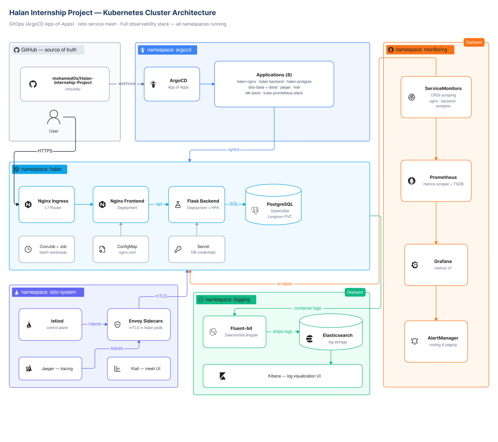

# Halan Internship Project

A cloud-native, 3-tier enterprise application deployed on Kubernetes using Helm charts, GitOps (ArgoCD), and production-grade observability (ELK, Prometheus/Grafana, Istio service mesh).

## Architecture



---

## 🏗️ Repository Structure

```text
halan-internship-project/
├── .github/
│   └── workflows/                   # CI: builds images and updates image tags in Git
├── docs/                            # Technical documentation & runbooks
│   ├── kubernetes.md                # Core resources, namespaces, and PVCs
│   ├── helm.md                      # Custom charts and upstream overrides
│   ├── argocd.md                    # GitOps workflow, sync waves, and hooks
│   ├── postgresql.md                # Database state, backups, and idempotency
│   ├── observability.md             # ELK stack and Prometheus metrics
│   ├── service-mesh.md              # Istio sidecars and Kiali
│   └── ci-cd.md                     # GitHub Actions and Docker build pipeline
├── frontend/                        # Nginx web server + HTML/CSS UI
├── backend/                         # Python Flask REST API
├── db/
│   └── init/
│       └── 01-init.sql              # Canonical DB schema & seed data (single source of truth)
├── infra/
│   └── k8s/                         # All Kubernetes manifests & Helm values
│       ├── namespace.yaml
│       ├── ingress.yaml
│       ├── cronjob.yaml             # Daily pg_dump backup job
│       ├── db-backup-pvc.yaml       # PVC for backup storage (Longhorn)
│       ├── argocd/                  # ArgoCD Application manifests — one file per service
│       │   ├── longhorn.yaml        # Longhorn storage (wave 1)
│       │   ├── istio-base.yaml      # Istio CRDs (wave 1)
│       │   ├── istiod.yaml          # Istio control plane (wave 1)
│       │   ├── halan-postgres.yaml  # Manages PostgreSQL chart (wave 3)
│       │   ├── halan-backend.yaml   # Manages custom Flask Helm chart (wave 3)
│       │   ├── halan-nginx.yaml     # Manages Nginx chart (wave 3)
│       │   ├── halan-infra.yaml     # Manages raw K8s manifests (wave 3)
│       │   ├── halan-db-seed.yaml   # Manages db-seed Helm chart (PostSync hook, wave 3)
│       │   ├── elasticsearch.yaml   # elastic/elasticsearch 8.5.1 (wave 4)
│       │   ├── kube-prometheus.yaml # prometheus-community/kube-prometheus-stack (wave 4)
│       │   ├── kibana.yaml          # elastic/kibana 8.5.1 (wave 5)
│       │   ├── fluent-bit.yaml      # Fluent Bit DaemonSet (wave 5)
│       │   └── kiali.yaml           # Kiali service mesh dashboard
│       ├── config/
│       │   ├── backend-config.yaml  # Non-sensitive ConfigMap
│       │   └── secrets.yaml         # DB credentials (use Vault/Sealed Secrets in prod)
│       └── helm/
│           ├── nginx/               # Nginx chart values
│           ├── postgres/            # PostgreSQL chart values
│           ├── backend/             # Custom Flask backend Helm chart
│           ├── db-seed/             # One-shot DB seeding Helm chart
│           │   ├── Chart.yaml
│           │   ├── values.yaml
│           │   ├── sql/ -> ../../../../../db/init/  (symlink)
│           │   └── templates/
│           │       ├── job.yaml
│           │       └── configmap.yaml
│           ├── elasticsearch/       # elasticsearch-values.yaml
│           ├── kibana/              # kibana-values.yaml
│           ├── fluent-bit/          # fluent-bit-values.yaml
│           ├── kube-prometheus/     # kube-prometheus-values.yaml
│           ├── istiod/              # istiod-values.yaml
│           ├── longhorn/            # longhorn-values.yaml
│           └── kiali/               # kiali-values.yaml
├── docker-compose.yml               # Local development environment
└── .env.example                     # Required environment variable reference
```

---

## 🚀 Option A: Local Development (Docker Compose)

### Prerequisites
- [Docker Engine](https://docs.docker.com/engine/install/) & Docker Compose plugin

```bash
git clone https://github.com/mohamed0s/Halan-Internship-Project.git
cd Halan-Internship-Project
cp .env.example .env
# Edit .env — set POSTGRES_PASSWORD
docker compose up -d --build
curl http://127.0.0.1:4000/api/name
```

**Expected output:**
```json
{ "name": "Mohamed", "source": "PostgreSQL Database", "status": "success" }
```

---

## ☸️ Option B: Kubernetes Cluster Setup (RKE2)

### Prerequisites

| Tool | Version | Notes |
|:-----|:--------|:------|
| Kubernetes | v1.28+ | RKE2 cluster running |
| `kubectl` | v1.28+ | Configured to point to your cluster |
| [Helm](https://helm.sh/docs/intro/install/) | v3+ | `curl https://raw.githubusercontent.com/helm/helm/main/scripts/get-helm-3 \| bash` |
| [Longhorn](https://longhorn.io/docs/latest/deploy/install/) | v1.6+ | Required for PVC storage |

*(RKE2 comes with an Nginx Ingress Controller pre-installed.)*

---

### Step 1 — Check Cluster Health

```bash
kubectl get nodes          # All nodes: Ready
kubectl get pods -n kube-system
```

---

### Step 2 — Add Helm Repositories

```bash
helm repo add argo   https://argoproj.github.io/argo-helm
helm repo add elastic https://helm.elastic.co
helm repo add prometheus-community https://prometheus-community.github.io/helm-charts
helm repo update
```

---

### Step 3 — Bootstrap the Cluster

```bash
cd infra/k8s/

# Namespace + config
kubectl apply -f namespace.yaml
kubectl apply -f config/

# Install ArgoCD
helm install argocd argo/argo-cd --create-namespace --namespace argocd

# Wait for ArgoCD pods
kubectl get pods -n argocd -w

# Apply all ArgoCD Application manifests — each app manages its own service
kubectl apply -f argocd/
```

ArgoCD picks up each `Application` manifest and syncs the corresponding service in sync-wave order. Each file in `argocd/` is an independent `Application` resource applied directly — there is no App of Apps parent wrapper.

> **DB seeding** is handled automatically by the `halan-db-seed` ArgoCD Application.
> It runs a one-shot Kubernetes Job as a PostSync hook — no manual `kubectl apply` needed.

---

### Step 4 — Verify

```bash
kubectl get all -n halan
# Expected: backend pods, nginx pods, halan-db-postgresql-0 StatefulSet
```

---

### Step 5 — Access the Application

```bash
export SERVER_IP="<YOUR_SERVER_IP>"
curl -I http://$SERVER_IP
curl http://$SERVER_IP/api/name
```

---

### Step 6 — ArgoCD UI

```bash
# Get initial admin password
kubectl -n argocd get secret argocd-initial-admin-secret \
  -o jsonpath="{.data.password}" | base64 -d; echo

kubectl port-forward --address 0.0.0.0 svc/argocd-server -n argocd 8080:443
# Open https://<SERVER_IP>:8080 — admin / <password above>
```

---

## 📊 Observability Dashboards

| Service | Namespace | Purpose | Port-Forward | Port |
|:--------|:----------|:--------|:-------------|:-----|
| **ArgoCD** | `argocd` | GitOps & CD | `kubectl port-forward --address 0.0.0.0 svc/argocd-server -n argocd 8080:443` | 8080 |
| **Kibana** | `logging` | Centralized Logs | `kubectl port-forward --address 0.0.0.0 svc/kibana-kibana -n logging 5601:5601` | 5601 |
| **Prometheus** | `monitoring` | Cluster Metrics | `kubectl port-forward --address 0.0.0.0 svc/kube-prometheus-stack-prometheus -n monitoring 9090:9090` | 9090 |
| **Grafana** | `monitoring` | Metrics Dashboards | `kubectl port-forward --address 0.0.0.0 svc/kube-prometheus-stack-grafana -n monitoring 3000:80` | 3000 |
| **Alertmanager** | `monitoring` | Alert Routing | `kubectl port-forward --address 0.0.0.0 svc/kube-prometheus-stack-alertmanager -n monitoring 9093:9093` | 9093 |
| **Kiali** | `istio-system` | Service Mesh Topology | `kubectl port-forward --address 0.0.0.0 svc/kiali -n istio-system 20001:20001` | 20001 |
| **Longhorn** | `longhorn-system` | Storage Management | `kubectl port-forward --address 0.0.0.0 svc/longhorn-frontend -n longhorn-system 8080:80` | 8080 |

---

## 🔑 Key Architectural Decisions

| Decision | Rationale |
|:---------|:----------|
| **Helm for all stateful/complex services** | Charts handle StatefulSets, PVCs, and upgrades correctly |
| **Custom Helm chart for backend** | Full template control while keeping Helm release management |
| **db-seed as a Helm PostSync hook** | Runs once after each ArgoCD sync, auto-deletes on success — never reconciled as a permanent object |
| **Symlink `db-seed/sql/` → `db/init/`** | Single source of truth for SQL; no copies, no drift |
| **Ingress is standalone** | Cluster-level routing grows independently as services are added |
| **HPA inside backend chart** | Tightly coupled to the Deployment lifecycle |
| **Official upstream charts for ELK & Prometheus** | Bitnami/Broadcom pulled their images from Docker Hub; official charts (`elastic/*`, `prometheus-community/*`) are maintained and publicly available |
| **Longhorn for all PVCs** | Production-grade distributed block storage with replication |
| **Secrets in `config/secrets.yaml`** | Learning environment only — use HashiCorp Vault or Sealed Secrets in production |

---

## ⚙️ Environment Configuration

| Variable | Description | Example |
|:---------|:------------|:--------|
| `POSTGRES_DB` | Database schema name | `halandb` |
| `POSTGRES_USER` | Database user | `pguser` |
| `POSTGRES_PASSWORD` | Database password | `your_secure_password` |
| `DB_PORT` | PostgreSQL port | `5432` |

---


---

## ⚠️ Fresh Install on New Nodes — Known Gotchas

> These are issues you **will** encounter on a brand-new cluster. Read this before deploying.

### 1. Elasticsearch Password Pinning

The Elastic Helm chart generates a **random** `ELASTIC_PASSWORD` on first render and stores it in the `elasticsearch-master-credentials` Secret. ES reads this value **only once** — during its very first startup on a blank PV. After that, the password lives inside ES's internal security index on the PV.

**The problem**: If you ever delete/recycle the ES pod (e.g., to fix a crash) without wiping the PV, ES ignores the new `ELASTIC_PASSWORD` env var and keeps the old one from the PV. But ArgoCD re-renders the Helm secret with a fresh random value → **password mismatch → Kibana pre-install hook gets 401**.

**The fix** (already applied): `elasticsearch-values.yaml` now pins a stable password via `extraEnvs`. For a fresh install, **change this password to a new strong value** before deploying. Do not leave it as-is from this repo.

> **Action required on fresh install**: Edit `infra/k8s/helm/elasticsearch/elasticsearch-values.yaml` and set a new `ELASTIC_PASSWORD` value before running `kubectl apply -f argocd/`.

---

### 2. Kibana Pre-Install Hook — `409 Secret Already Exists`

The Kibana chart's `pre-install` Job (`manage-es-token.js`) runs a 3-step sequence:
1. DELETE the old ES service token (404 is OK)
2. POST to create a new ES service token
3. POST to create the `kibana-kibana-es-token` k8s Secret

If the hook **partially succeeds** (e.g., step 2 completes but step 3 fails), the next ArgoCD retry will fail with:
```
secrets "kibana-kibana-es-token" already exists
```
This is a **known bug in Kibana chart 8.5.1** — the script has no idempotency for the k8s secret creation.

**Fix**: Before each Kibana sync attempt (or whenever Kibana is stuck), run:
```bash
kubectl delete secret kibana-kibana-es-token -n logging --ignore-not-found
kubectl delete job pre-install-kibana-kibana -n logging --ignore-not-found
```
Then trigger a fresh ArgoCD sync.

---

### 3. ArgoCD Owns the ES Credentials Secret — Do Not Patch It Directly

The `elasticsearch-master-credentials` Secret is managed by ArgoCD (`selfHeal: true`). Any `kubectl patch` or `kubectl apply` on it will be silently **reverted within seconds**.

If you ever need to update the password mid-cluster (not on fresh install):
```bash
# Step 1: Tell ArgoCD to ignore manual changes to this secret
kubectl annotate secret elasticsearch-master-credentials -n logging \
  argocd.argoproj.io/compare-options=IgnoreExtraneous --overwrite

# Step 2: Delete and recreate with the correct password
kubectl delete secret elasticsearch-master-credentials -n logging
kubectl create secret generic elasticsearch-master-credentials -n logging \
  --from-literal=username=elastic \
  --from-literal=password=<CORRECT_PASSWORD>
```

---

### 4. Sync Wave Order Matters

The ArgoCD Applications use sync waves:
- Wave 4: `elasticsearch`
- Wave 5: `kibana`

Kibana **must not** be synced until Elasticsearch is fully `Healthy` and `Synced`. ArgoCD handles this automatically via sync waves, but if you manually force-sync all apps at once, Kibana's pre-install hook will fail because ES isn't ready yet.

**Safe order for manual recovery**:
```bash
# Wait for ES to be healthy first
kubectl get application elasticsearch -n argocd -w

# Then sync Kibana
kubectl patch application kibana -n argocd --type merge -p '{"operation":{"initiatedBy":{"username":"admin"},"sync":{"revision":"HEAD","prune":true,"syncStrategy":{"hook":{"force":true}}}}}'
```

## 🚧 Known Limitations & Future Work (Production Gaps)

This project was built for an internship to demonstrate deep architectural knowledge. However, if this were deployed in a true production environment, the following gaps would need to be addressed:

- **Secrets Management**: Secrets (like database passwords) are currently stored in plaintext in the repository for learning purposes. In a real environment, I would use **HashiCorp Vault** or **Sealed Secrets**.
- **TLS/HTTPS**: TLS termination is not currently configured. For production, this would be handled via **cert-manager** and **Let's Encrypt** directly on the Nginx Ingress.
- **Backup Strategy**: The daily database backups are currently piped to a local Longhorn PVC. In a production cluster, the `pg_dump` CronJob would stream the `.sql.gz` file directly to an off-site object storage bucket (like **AWS S3**).

---

## 🗺️ Engineering Roadmap

- [x] **Phase 1**: Docker containerization & non-root security baseline
- [x] **Phase 2**: Docker Compose orchestration with persistent storage
- [x] **Phase 3**: Monorepo restructuring & CI/CD with GitHub Actions
- [x] **Phase 4**: Nginx reverse proxy & presentation tier
- [x] **Phase 5**: Kubernetes migration (Namespace, Deployments, Services, Ingress)
- [x] **Phase 6**: Helm charts (Nginx, PostgreSQL, custom Backend chart)
- [x] **Phase 7**: Resource requests & limits (CPU/Memory QoS)
- [x] **Phase 8**: Horizontal Pod Autoscaler (HPA)
- [x] **Phase 9**: Kubernetes Secrets & ConfigMaps
- [x] **Phase 10**: Persistent Volumes (PostgreSQL StatefulSet + PVC)
- [x] **Phase 11**: Jobs & CronJobs
- [x] **Phase 12**: Ingress (L7 routing)
- [x] **Phase 13**: ArgoCD GitOps — multi-app declarative deployment, multi-source Helm, automated image tag updates
- [x] **Phase 14**: ELK Stack (Elasticsearch + Kibana + Fluent Bit)
- [x] **Phase 15**: Service Mesh (Istio + Kiali)
- [x] **Phase 16**: Prometheus & Grafana observability (kube-prometheus-stack)
- [x] **Phase 17**: DB seeding via Helm PostSync hook — DRY, idempotent, ArgoCD-native
- [x] **Phase 18**: Daily pg_dump backup CronJob with Longhorn-backed PVC