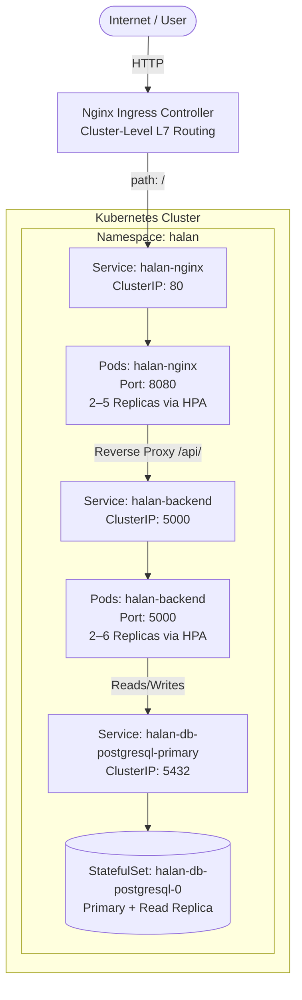

# Kubernetes Implementation — Architecture & Runbook

This document captures the complete Kubernetes deployment architecture for the Halan Internship Project, reflecting the actual current state of `infra/k8s/`.

---

## 🏛️ Architecture Overview

The system runs in the `halan` namespace across a 3-tier microservices architecture. All external traffic enters through a single Nginx Ingress Controller and flows down to the appropriate backend services.



---

## 📦 Component Breakdown

### 1. Frontend — Nginx
- **Deployment method:** Bitnami `bitnami/nginx` Helm chart
- **Chart values:** `infra/k8s/helm/nginx/nginx-values.yaml`
- **Key config:**
  - Runs non-root on port `8080` internally
  - Custom `serverBlock` in values configures Nginx as a reverse proxy: all `/api/` requests are forwarded to `halan-backend:5000`
  - HPA managed directly via Helm values (`autoscaling.enabled: true`)
  - Exposed internally via ClusterIP Service

### 2. Backend — Python Flask
- **Deployment method:** Custom Helm chart at `infra/k8s/helm/backend/`
- **Chart structure:**
  ```text
  helm/backend/
  ├── Chart.yaml          ← Chart identity & version
  ├── values.yaml         ← All configurable parameters
  └── templates/
      ├── deployment.yaml ← Pod spec with health probes & resource limits
      ├── service.yaml    ← ClusterIP Service to expose the backend
      └── hpa.yaml        ← HPA (conditional on autoscaling.enabled)
  ```
- **Configuration injection:**
  - Non-sensitive env vars (`DB_HOST`, `DB_PORT`, `DB_NAME`, `DB_USER`) loaded from `ConfigMap: backend-config`
  - Database password loaded from `Secret: halan-db-secret`
- **Health probes:**
  - `livenessProbe` — polls `GET /health` every 20s; restarts pod after 3 failures
  - `readinessProbe` — polls `GET /health` every 10s; removes pod from Service endpoints after 3 failures
- **Resource management:**
  - Requests: `100m CPU`, `128Mi RAM`
  - Limits: `250m CPU`, `256Mi RAM`
- **HPA:** Scales between 2 and 6 replicas when average CPU exceeds 50% of requests

### 3. Database — PostgreSQL
- **Deployment method:** Bitnami `bitnami/postgresql` Helm chart
- **Chart values:** `infra/k8s/helm/postgres/postgres-values.yaml`
- **Architecture:** `replication` mode — 1 Primary StatefulSet pod + 2 Read Replica pods
- **Storage:** PVC backed by `longhorn` StorageClass (use `standard` on Minikube)
- **Credentials:** Pulled from pre-existing Secret `halan-db-secret`
- **Why StatefulSet?** Each pod gets a stable DNS name (`halan-db-postgresql-primary-0`), its own PVC that survives restarts, and ordered startup/shutdown for safe replica election.

---

## ⚙️ Standalone Cluster Resources

These resources are **not** managed by any Helm chart because their lifecycle is independent of any single service.

| File | Resource | Reason for being standalone |
|:-----|:---------|:---------------------------|
| `namespace.yaml` | Namespace `halan` | Bootstrap resource — must exist before everything else |
| `config/backend-config.yaml` | ConfigMap | Shared app config, not owned by any one service chart |
| `config/secrets.yaml` | Secret | Sensitive credentials — managed separately (use Vault/Sealed Secrets in prod) |
| `ingress.yaml` | Ingress | Cluster-level routing — grows independently as new services are added |
| `job.yaml` | Job | One-off database migration — lifecycle independent of backend deployments |
| `cronjob.yaml` | CronJob | Scheduled cluster task — not tied to any service release cycle |

---

## 🔀 Helm Release Summary

| Release Name | Chart | Namespace | Values File |
|:-------------|:------|:----------|:------------|
| `halan-nginx` | `bitnami/nginx` | `halan` | `helm/nginx/nginx-values.yaml` |
| `halan-db` | `bitnami/postgresql` | `halan` | `helm/postgres/postgres-values.yaml` |
| `halan-backend` | `./helm/backend` (custom) | `halan` | `helm/backend/values.yaml` |
| `argocd` | `argo/argo-cd` | `argocd` | default |

---

## 🌐 Internal Service Discovery (CoreDNS)

No IP addresses are hardcoded anywhere. All inter-service communication uses Kubernetes DNS:

| From | To | DNS Name |
|:-----|:---|:---------|
| Nginx pod | Flask backend | `http://halan-backend:5000` |
| Flask pod | PostgreSQL | `halan-db-postgresql-primary:5432` |

---

## ♻️ GitOps with ArgoCD (Phase 13)

ArgoCD runs in the `argocd` namespace and continuously reconciles the cluster state with this Git repository.

**Self-healing behavior:** If someone manually runs `kubectl edit` or `kubectl scale` to change a resource, ArgoCD detects the **drift** between Git (source of truth) and the cluster, and automatically reverts the change back to what is defined in Git.

**Workflow after ArgoCD is set up:**
```
Developer pushes code
       ↓
GitHub Actions builds & pushes Docker image to DockerHub
       ↓
Developer updates image tag in helm/backend/values.yaml and pushes to Git
       ↓
ArgoCD detects Git change → syncs cluster → rolling update begins
       ↓
Zero-downtime deployment complete
```

> **Note:** `infra/k8s/deploy.sh` is a **bootstrap-only** script used for the initial cluster setup. After ArgoCD is configured, it is no longer needed for application deployments.

---

## 🔒 Security Notes

| Topic | Current Approach | Production Recommendation |
|:------|:----------------|:--------------------------|
| Database credentials | `config/secrets.yaml` (plaintext in Git) | HashiCorp Vault or Bitnami Sealed Secrets |
| Container privileges | Non-root user (`appuser`) in Docker image | ✅ Already production-ready |
| Network isolation | All services on `ClusterIP` — only Ingress is externally reachable | ✅ Already production-ready |
| TLS termination | Not yet configured | Add cert-manager + Let's Encrypt Ingress annotations |
