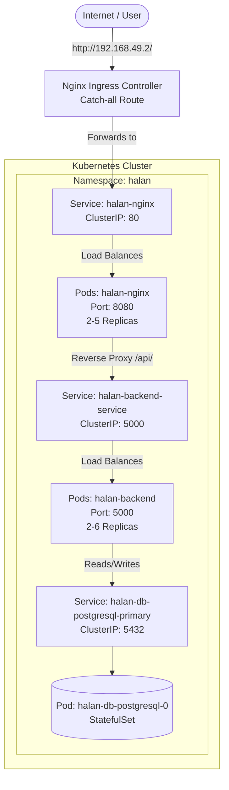

# Kubernetes Implementation Documentation

This document summarizes the transition from Docker Compose to a fully production-ready Kubernetes architecture (Phases 1 through 13).

---

## 🏛️ Architecture Overview

The system is deployed in the `halan` namespace and utilizes a 3-tier microservices architecture consisting of a Frontend (Nginx), Backend (Flask), and Database (PostgreSQL).

---

## 📦 Component Breakdown

### 1. The Frontend (Nginx)
- **Deployment Method:** Bitnami Helm Chart (`bitnami/nginx`)
- **Key Configurations:**
  - Non-root execution (listening on port 8080 internally).
  - Reverse Proxy configured via `serverBlock` in `nginx-values.yaml` to forward `/api/` traffic to the backend.
  - Exposed virtually on port 80 via the `halan-nginx` ClusterIP Service.

### 2. The Backend (Python Flask)
- **Deployment Method:** Custom Kubernetes Deployment (`backend-deployment.yaml`)
- **Security:** Runs as a non-root user (`appuser`).
- **Configuration & Secrets:**
  - Database credentials injected securely via K8s `Secret`.
  - Environment variables injected via K8s `ConfigMap`.
- **Health Checks:**
  - `livenessProbe` checks `/health` every 20s to restart frozen pods.
  - `readinessProbe` checks `/health` every 10s to ensure traffic is only sent to ready pods.
- **Resource Management:**
  - Requests: `100m CPU`, `128Mi RAM` (Guaranteed minimums).
  - Limits: `250m CPU`, `256Mi RAM` (Hard caps to prevent node starvation/OOM).

### 3. The Database (PostgreSQL)
- **Deployment Method:** Bitnami Helm Chart (`bitnami/postgresql`)
- **Architecture:** Deployed as a `StatefulSet` to ensure data persistence and stable network identity (`halan-db-postgresql-primary-0`).
- **Storage:** Backed by a Persistent Volume Claim (PVC) using the `standard` storage class (ready to be swapped to `longhorn` in Phase 15).

---

## ⚙️ Advanced Features Implemented

### 1. L7 Ingress Controller
We completely removed `NodePort` in favor of an **Nginx Ingress Controller**. 
- It acts as the single public entry point for the entire cluster.
- Routes traffic natively to the internal `ClusterIP` services.

### 2. Horizontal Pod Autoscaling (HPA)
Both the Frontend and Backend are dynamically autoscaled based on CPU utilization.
- **Backend HPA:** Scales between 2 and 6 replicas if average CPU exceeds 50%.
- **Frontend HPA:** Scales between 2 and 5 replicas (managed directly via Helm values).
- The HPA replaces static replica counts, allowing the cluster to respond to traffic spikes and scale down during quiet periods to save resources.

### 3. Internal CoreDNS Resolution
No IP addresses are hardcoded. Microservices discover each other using Kubernetes internal DNS:
- Nginx finds Flask via `http://halan-backend-service:5000`
- Flask finds Postgres via `halan-db-postgresql-primary`
